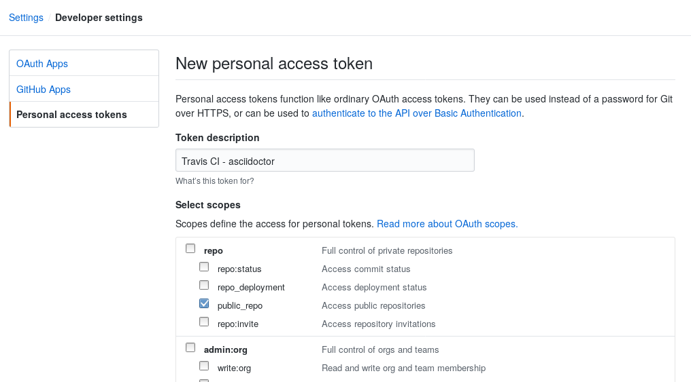
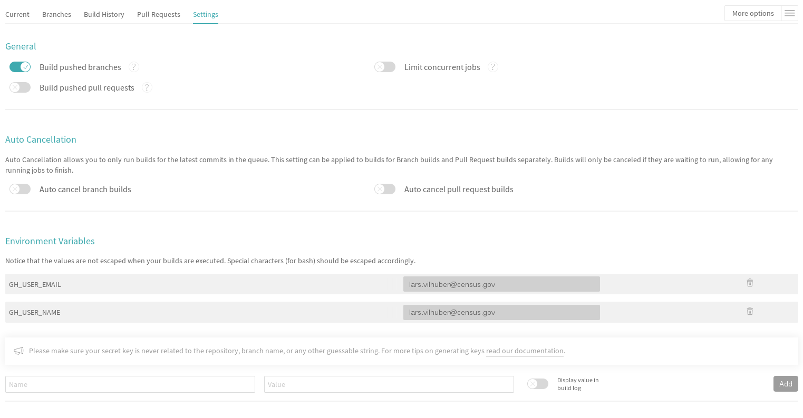

# Using Travis CI in conjunction with ASCIIDOCTOR to build a static website

This is heavily based on http://mgreau.com/posts/2016/03/28/asciidoc-to-gh-pages-with-travis-ci-docker-asciidoctor.html , updated for February 2019.

## Prerequisites

This post assumes that:

  [x] you know AsciiDoc and [Asciidoctor](https://asciidoctor.org/)

  [x] you have a GitHub account and a GitHub project configured to publish content from the gh-pages branch

  [ ] if it’s not the case you can read the [GitHub tutorials](https://help.github.com/articles/creating-project-pages-manually/) about GitHub Pages

  [x] you have a Travis account linked to your GitHub account

  [ ] if it’s not the case, you can read the [Travis CI Guide for beginners](https://docs.travis-ci.com/user/for-beginners)

## Set up the build user (Github)

- You may want to create a custom user for the build process (`buildbot123`)
- For the user to be used for the build, go to the *user* settings, and generate a key (personal access token). This will be used to do password-less login.

Copy that key somewhere safe. As they will say, you won't see it again on the Github page. It is good practice if you reconfigure the build process to generate a new key. 

## Set up Travis

- Connect  Github and Travis - go to https://travis-ci.com and log in with your Github account

Then, as shown below, go to the Project Settings tabs and configure it:

 [ ] Check some options on General Settings
   - <strike>check the Build only if .travis.yml is present option</strike> No longer present in 2019
   -  check the *Build pushed branches* option

 [ ] Create some Environment Variables that will be used in .travis.yml file:
   - GH_USER_NAME : your GitHub username
   - GH_USER_EMAIL : your GitHub account email
   - GH_TOKEN: the token created on previous step
   - GH_REF: the hostname and repository name (e.g., `github.com/organization/repos`). Do not put the `https` here!

The following [`.travis.yml`](.travis.yml) file worked for us. 

<code>
sudo: required

services:
  - docker                  

before_install:            
  - mkdir -p output
  - docker pull asciidoctor/docker-asciidoctor

script:
  - docker run -v $TRAVIS_BUILD_DIR:/documents/ --name asciidoc-to-html asciidoctor/docker-asciidoctor /documents/process_latest.sh      
  
after_error: 
  - docker logs asciidoc-to-html

after_failure:
  - docker logs asciidoc-to-html

after_success:      
  - git config user.name "${GH_USER_NAME}"
  - git config user.email "${GH_USER_EMAIL}"
  - git add . ; git commit -m "Deploy to GitHub Pages"
  - git push --force --quiet "https://${GH_USER_NAME}:${GH_TOKEN}@${GH_REF}" master:gh-pages > /dev/null 2>&1
</code>

# Maintenance

The documents are built in ASCIIDOC format (similar to Markdown, but more flexible).

You can monitor the build process on [https://travis-ci.com/organization/repo/settings](https://travis-ci.com/).

The conversion to web pages is done using [asciidoctor](https://asciidoctor.org/docs/asciidoctor/). The conversion to PDF is done using [asciidoctor-pdf](https://asciidoctor.org/docs/asciidoctor-pdf/).